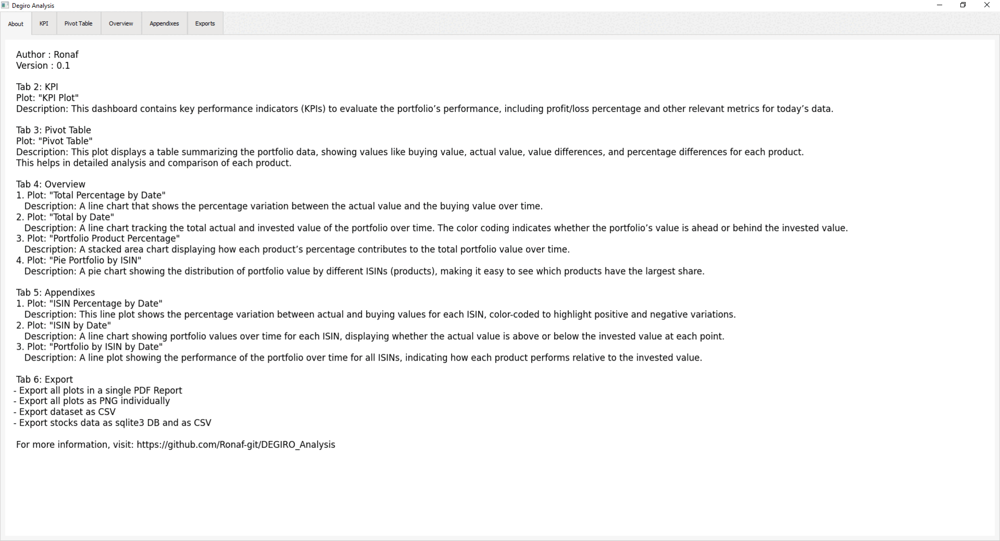

# DEGIRO_Analysis

DEGIRO_Analysis is a Python-based project designed to help users track their investments using the transaction data exported from Degiro, a popular online investment platform. By processing the transactions in CSV format, it provides users with insights into their investment performance.

## Features

- Process and clean transaction data from Degiro's CSV export.
- Analyze investment history and performance.
- Visualize investment data for better understanding.
- Dedicated Windows Interface

- Outputs, like a [PDF Report](./Docs/Output_example/Date/Degiro%20Analysis.pdf), Stock Data DB, ...

## How to 
### Running Executable on Windows
1. Download the latest release from the [Releases page](https://github.com/Ronaf-git/DEGIRO_Analysis/releases).
2. Extract the archive into a dedicated folder
3. Drop your Degiro export "transaction.csv" into the "source" folder (Dont forget to delete the sample)
4. Run the executable to see your reports. 

Note: Exported files will be saved in the "output" folder.

## Coming Next

- Dividend/stock split/... use cases 
- Web UI
- Portfolio Analysis by sector
- Portfolio Analysis by asset type
- Date/Stock/... selectors

## Note

- Datas may not be 100% accurate
- The dictionary linking Exchange to Yahoo Finance suffix may be inaccurate
- APIs can be broken

## License

This project is licensed under the MIT License - see the [LICENSE](LICENSE) file for details.
